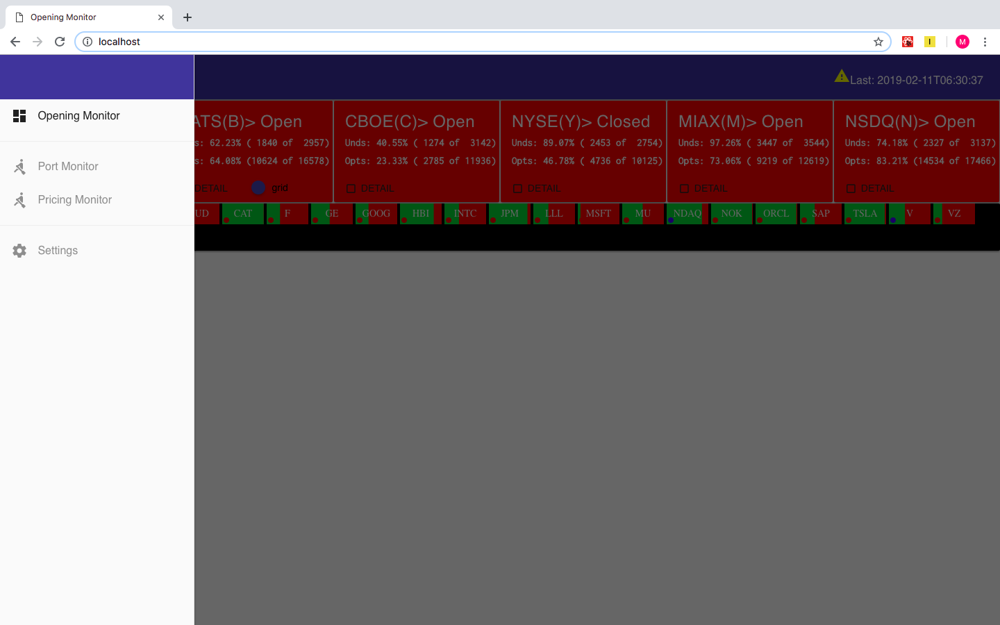

Realtime dashboard portal
=========================
This is a personal project which ended up growing into an operations tool used at Nasdaq.


Goals
-----
The main overarching goal of this project was to demonstrate how a containerized custom dashboard could be deployed to a kubernetes cluster and be used by operations personnel to monitor production systems.

Functional goals
----------------
* Accurately reflect the state of upstream system in near-realtime fashion
* UI must be reactive 

Technical Goals
---------------
* Evaluate Flux and Immutable.js 
* Evaluate frontend build tools 
* Utilize ES6 javascript constructs
* Develop custom D3 components
* Evaluate docker compose as a dev orchestration tool
* Deploy containerized app to production kubernetes cluster





Architecture
------------
* Middle tier 

  Compressed data tier and Service API

* Web server
* UI

# Middle tier
The middle tier contains an embedded stream producer.  The stream producer feeds a data pipeline.  The data pipeline publishes to the embedded data service.

A service layer is embedded to service the UI by serving data from the embedded data service.

# Web server
The web server differs in dev vs production-like mode.

In dev mode, the system leverages a built-in express server.

In prod mode, an nginx server is configured to serve the ui bundle and reverse proxy calls to the middle-tier service API.

# UI
The UI is built using the following:
* React
* Flux
* React Toolbox component library
* D3 custom components
* Immutable.js

## Flux
A key aspect of the UI architecture is use of the Flux pattern of data flows.

https://github.com/facebook/flux/blob/master/examples/flux-concepts/flux-simple-f8-diagram-with-client-action-1300w.png

As described elsewhere, Actions are the driving force behind UI architectures using flux and represent the API of the UI.  Actions typically originate from a view, either driven by user interaction or some timed event.  They may also originate on receipt of data from a subscription.  Actions are dispatched to one or more stores via a singleton dispatcher, and acted upon by these stores such as to modify the state from which the views are projected.  A store may handle an Action, possibly update it's state, and emit a change event.  Views that register to a store may then choose to re-render components if desired. 

### Lessons learned
Flux has very little boiler plate to deal with and has a relatively flat learning curve.  

### Next steps
Evaluate Redux.

See https://facebook.github.io/flux/docs/overview.html.


Ingestion
---------
In a real solution, data would be published by an upstream socket-server.  Here, the data stream is simulated by a Java stream implementation.  

At the time of this writing, no parsing of binary data is required. The stream publishes data already decoded into native messaging fields.  The stream pipeline maps these messages into domain stats messages and stores into the embedded data cache component.

There is an arbitrary Thread.sleep embedded in the pipeline as a dumb way to avoid a tight loop / cpu spin.


### Lessons learned
The stream generator is very cpu intensive absent some kind of throttle.

Assuming there is not need to provide updates to a UI more frequently than once every second or two, an upstream provider may be useful to only provide snapshots to an API server at the same frequence as updates are desired to the UI.  

Without throttling, it is left to the UI or server push mechanism to avoid overwhelming the UI with updates.

Especially when using web-sockets, it is important that the dashboard provider implement some type of throttling mechanism to avoid overwhelming the UI.


Note regarding Data API / Service API
--------------------------------------
The backend architecture is not intended to be scalable.

A scalable architecture would separate the following:
* Ingestion of upstream data
* Publishing of transformed ingested data to data tier
* Data API
* Service API


Build
-----

### Todo's
* Add k8 configuration
* Perform gradle builds within docker for portability (no need to install npm / gradle locally)

### Prerequisites
* npm (installed via node plugin)
* Docker 
* Local docker registry (required by k8)
* gradle


### mon-mt
  
1. Pull base image  
    ```
    docker pull nimmis/java-centos:oracle-8-jre
    docker tag nimmis/java-centos:oracle-8-jre localhost:5000/nimmis/java-centos:oracle-8-jre
    ```

1. Build executable jar and create rpm  
    ```
    gradle mon-mt:bootRepackage mon-mt:createRpm
    ```

1. Stage rpm into docker context
    For example:
    
    ```
    cp mon-mt/build/distributions/mon-ng-app-0.0.1-1.x86_64.rpm mon-mt/docker
    ```

1. Build / tag mon-mt image 
    For example:

    ```
     docker build  --build-arg MON_VERSION=0.0.1-1 --target release --rm -t localhost:5000/options/mon-ng/mon-mt:latest -f mon-mt/Dockerfile mon-mt/docker
    ```
### mon-ui

1. pull base image
    ```
    docker pull centos:7
    ```

1. Create rpm
    ```
    gradle mon-ui:createRpm
    ````

1. Stage rpm into docker context
    For example:
    ```
    cp mon-ui/build/distributions/mon-ui-0.0.1-1.x86_64.rpm mon-ui/docker/
    ```

1. Build / tag mon-ui image
    For example:
    ```
    docker build  --build-arg MON_VERSION=0.0.1-1 --target release --rm -t localhost:5000/options/mon-ng/mon-ui:latest -f mon-ui/Dockerfile mon-ui/docker
    ```


### Execution w/ docker-compose

Build images as described earlier

Run docker-compose up...

```console
Michaels-Air:mon-ng grudkowm$ docker-compose up
Creating network "mon-ng_default" with the default driver
Creating mon-ng_monmt_1 ... done
Creating mon-ng_monui_1 ... done
Attaching to mon-ng_monmt_1, mon-ng2_monui_1
monmt_1  | Starting app...
monmt_1  | mon-mt entrypoint [hostip=172.20.0.2]total 27256
monmt_1  | -rw-r--r-- 1 root users 27895012 Feb 10 12:22 mon-ng-app-0.0.1.jar
monmt_1  | drwxr-xr-x 1 root users     4096 Feb 10 12:23 ..
monmt_1  | drwxr-xr-x 1 root users     4096 Feb 10 12:23 .
monmt_1  | drwxr-xr-x 1 root users     4096 Feb 10 22:11 config
monmt_1  | PING 172.20.0.2 (172.20.0.2) 56(84) bytes of data.
monmt_1  | 64 bytes from 172.20.0.2: icmp_seq=1 ttl=64 time=0.056 ms
monmt_1  |
monmt_1  | --- 172.20.0.2 ping statistics ---
monmt_1  | 1 packets transmitted, 1 received, 0% packet loss, time 0ms
monmt_1  | rtt min/avg/max/mdev = 0.056/0.056/0.056/0.000 ms
monmt_1  | 22:11:39.505 [main] INFO com.notatracer.monitoring.MiddleTierApp - Main...
monui_1  | Starting nginx....
monui_1  | wait-for-it.sh: waiting 15 seconds for monmt:8080
monmt_1  |
monmt_1  |   .   ____          _            __ _ _
monmt_1  |  /\\ / ___'_ __ _ _(_)_ __  __ _ \ \ \ \
monmt_1  | ( ( )\___ | '_ | '_| | '_ \/ _` | \ \ \ \
monmt_1  |  \\/  ___)| |_)| | | | | || (_| |  ) ) ) )
monmt_1  |   '  |____| .__|_| |_|_| |_\__, | / / / /
monmt_1  |  =========|_|==============|___/=/_/_/_/
monmt_1  |  :: Spring Boot ::        (v1.5.7.RELEASE)
monmt_1  |
monmt_1  | 2019-02-10 22:11:41.228  INFO 1 --- [           main] com.notatracer.monitoring.MiddleTierApp  : Starting MiddleTierApp on 55bd9787e756 with PID 1 (/apps/grudkowm/dash-mon/mon-ng-app-0.0.1.jar started by root in /apps/grudkowm/dash-mon)
monmt_1  | 2019-02-10 22:11:41.231  INFO 1 --- [           main] com.notatracer.monitoring.MiddleTierApp  : No active profile set, falling back to default profiles: default
monmt_1  | 2019-02-10 22:11:41.387  INFO 1 --- [           main] ationConfigEmbeddedWebApplicationContext : Refreshing org.springframework.boot.context.embedded.AnnotationConfigEmbeddedWebApplicationContext@3b764bce: startup date [Sun Feb 10 22:11:41 UTC 2019]; root of context hierarchy
monmt_1  | 2019-02-10 22:11:43.372  INFO 1 --- [           main] o.s.b.f.s.DefaultListableBeanFactory     : Overriding bean definition for bean 'requestContextFilter' with a different definition: replacing [Root bean: class [null]; scope=; abstract=false; lazyInit=false; autowireMode=3; dependencyCheck=0; autowireCandidate=true; primary=false; factoryBeanName=org.springframework.boot.autoconfigure.jersey.JerseyAutoConfiguration; factoryMethodName=requestContextFilter; initMethodName=null; destroyMethodName=(inferred); defined in class path resource [org/springframework/boot/autoconfigure/jersey/JerseyAutoConfiguration.class]] with [Root bean: class [org.springframework.boot.autoconfigure.web.WebMvcAutoConfiguration$WebMvcAutoConfigurationAdapter]; scope=; abstract=false; lazyInit=false; autowireMode=3; dependencyCheck=0; autowireCandidate=true; primary=false; factoryBeanName=null; factoryMethodName=requestContextFilter; initMethodName=null; destroyMethodName=(inferred); defined in class path resource [org/springframework/boot/autoconfigure/web/WebMvcAutoConfiguration$WebMvcAutoConfigurationAdapter.class]]
monmt_1  | 2019-02-10 22:11:44.308  INFO 1 --- [           main] f.a.AutowiredAnnotationBeanPostProcessor : JSR-330 'javax.inject.Inject' annotation found and supported for autowiring
monmt_1  | 2019-02-10 22:11:45.413  INFO 1 --- [           main] org.eclipse.jetty.util.log               : Logging initialized @7061ms to org.eclipse.jetty.util.log.Slf4jLog
```

### Standalone execution

1. Run mon-mt app

    Either run standalone jar, or use bootRun task:
    
    Standalone jar...
    ```
    gradle mon-mt:clean mon-mt:bootRepackage
    ```
    
    ```
    java -jar mon-mt/build/libs/mon-app-0.0.1.jar
    ```
    
    bootRun...
    ```console
    Michaels-Air:mon-ng2 grudkowm$ gradle mon-mt:bootRun
    :mon-mt:compileJava
    :mon-mt:processResources
    :mon-mt:classes
    :mon-mt:findMainClass
    :mon-mt:bootRun
    17:21:17.089 [main] INFO com.notatracer.monitoring.MiddleTierApp - Main...
    
      .   ____          _            __ _ _
     /\\ / ___'_ __ _ _(_)_ __  __ _ \ \ \ \
    ( ( )\___ | '_ | '_| | '_ \/ _` | \ \ \ \
     \\/  ___)| |_)| | | | | || (_| |  ) ) ) )
      '  |____| .__|_| |_|_| |_\__, | / / / /
     =========|_|==============|___/=/_/_/_/
     :: Spring Boot ::        (v1.5.7.RELEASE)
    
    2019-02-10 17:21:17.865  INFO 9245 --- [           main] com.notatracer.monitoring.MiddleTierApp  : Starting     MiddleTierApp on Michaels-Air.fios-router.home with PID 9245 (/Users/grudkowm/Documents/repositories/personal_    projects/mon-ng2/mon-mt/build/classes/main started by grudkowm in /Users/grudkowm/Documents/repositories/personal_    projects/mon-ng2)
    2019-02-10 17:21:17.866  INFO 9245 --- [           main] com.notatracer.monitoring.MiddleTierApp  : No active profile     set, falling back to default profiles: default
    2019-02-10 17:21:17.949  INFO 9245 --- [           main] ationConfigEmbeddedWebApplicationContext : Refreshing org.    springframework.boot.context.embedded.AnnotationConfigEmbeddedWebApplicationContext@4ac3c60d: startup date [Sun Feb     10 17:21:17 EST 2019]; root of context hierarchy
    2019-02-10 17:21:19.149  INFO 9245 --- [           main] o.s.b.f.s.DefaultListableBeanFactory     : Overriding bean     definition for bean 'requestContextFilter' with a different definition: replacing [Root bean: class [null]; scope=;     abstract=false; lazyInit=false; autowireMode=3; dependencyCheck=0; autowireCandidate=true; primary=false;     factoryBeanName=org.springframework.boot.autoconfigure.jersey.JerseyAutoConfiguration;     factoryMethodName=requestContextFilter; initMethodName=null; destroyMethodName=(inferred); defined in class path     resource [org/springframework/boot/autoconfigure/jersey/JerseyAutoConfiguration.class]] with [Root bean: class [org.    springframework.boot.autoconfigure.web.WebMvcAutoConfiguration$WebMvcAutoConfigurationAdapter]; scope=;     abstract=false; lazyInit=false; autowireMode=3; dependencyCheck=0; autowireCandidate=true; primary=false;     factoryBeanName=null; factoryMethodName=requestContextFilter; initMethodName=null; destroyMethodName=(inferred);     defined in class path resource [    org/springframework/boot/autoconfigure/web/WebMvcAutoConfiguration$WebMvcAutoConfigurationAdapter.class]]
    2019-02-10 17:21:19.684  INFO 9245 --- [           main] f.a.AutowiredAnnotationBeanPostProcessor : JSR-330 'javax.    inject.Inject' annotation found and supported for autowiring
    2019-02-10 17:21:20.085  INFO 9245 --- [           main] org.eclipse.jetty.util.log               : Logging     initialized @3292ms to org.eclipse.jetty.util.log.Slf4jLog
    2019-02-10 17:21:20.297  INFO 9245 --- [           main] e.j.JettyEmbeddedServletContainerFactory : Server     initialized with port: 8080
    2019-02-10 17:21:20.300  INFO 9245 --- [           main] org.eclipse.jetty.server.Server          : jetty-9.4.6.    v20170531
    2019-02-10 17:21:20.550  INFO 9245 --- [           main] org.eclipse.jetty.server.session         : D
    ```
    
1. Run mon-ui app

  Either use gradle task, or run npm separately:

    ```console
    Michaels-Air:mon-ng grudkowm$ gradle mon-ui:webpack_dev_start
    :mon-ui:nodeSetup UP-TO-DATE
    :mon-ui:npmSetup SKIPPED
    :mon-ui:npmInstall UP-TO-DATE
    :mon-ui:webpack_dev_start
    Project is running at http://localhost:8081/
    webpack output is served from /k_dev_start
    Conte    nt not from webpack is served from ./dist
    webpack: wait until bundle finished: /
    Hash: 95992ca7c2b34de95095
    Version: webpack 3.12.0
    Time: 11057ms
         Asset       Size  Chunks                    Chunk Names
     bundle.js    3.44 MB       0  [emitted]  [big]  main
    index.html  553 bytes          [emitted]
       [3] ./node_modules/react/react.js 56 bytes {0} [built]
      [37] ./node_modules/react-dom/index.js 59 bytes {0} [built]
     [428] multi (webpack)-dev-server/client?http://localhost:8081 ./src/main.jsx 40 bytes {0} [built]
     [429] (webpack)-dev-server/client?http://localhost:8081 7.93 kB {0} [built]
     [430] ./node_modules/url/url.js 23.3 kB {0} [built]
     [436] ./node_modules/strip-ansi/index.js 161 bytes {0} [built]
     [438] ./node_modules/loglevel/lib/loglevel.js 7.86 kB {0} [built]
     [439] (webpack)-dev-server/client/socket.js 1.08 kB {0} [built]
     [441] (webpack)-dev-server/client/overlay.js 3.67 kB {0} [built]
     [446] (webpack)/hot nonrecursive ^\.\/log$ 170 bytes {0} [built]
     [447] (webpack)/hot/log.js 1.04 kB {0} [optional] [built]
     [448] (webpack)/hot/emitter.js 77 bytes {0} [built]
     [449] ./src/main.jsx 963 bytes {0} [built]
     [450] ./src/AppContainer.jsx 6.24 kB {0} [built]
     [866] ./src/actions/Actions.jsx 2.44 kB {0} [built]
        + 867 hidden modules
    webpack: Compiled successfully.
    > Building 75% > :mon-ui:webpack_dev_start
    ```
    
    or 
    
    ```console
    Michaels-Air:mon-ng grudkowm$ npm --prefix ./mon-ui run build:dev

    > mon-ui@0.1.0 build:dev /Users/grudkowm/Documents/repositories/personal_projects/mon-ng/mon-ui
    > webpack --env.dev --config ./webpack.dev.js
    
    Hash: 5b4b35c45dedbc07e1cc
    Version: webpack 3.12.0
    Time: 6393ms
         Asset       Size  Chunks                    Chunk Names
     bundle.js    3.13 MB       0  [emitted]  [big]  main
    index.html  553 bytes          [emitted]
      [63] (webpack)/buildin/global.js 509 bytes {0} [built]
     [260] ./src/AppDispatcher.jsx 112 bytes {0} [built]
     [261] ./src/actions/ActionTypes.jsx 473 bytes {0} [built]
     [402] ./src/public/css/styles.css 1.06 kB {0} [built]
     [425] ./src/main.jsx 963 bytes {0} [built]
     [426] ./src/AppContainer.jsx 6.24 kB {0} [built]
     [581] ./src/stores/MonStore.jsx 12.1 kB {0} [built]
     [686] (webpack)/buildin/module.js 517 bytes {0} [built]
     [687] ./node_modules/moment/locale ^\.\/.*$ 3.07 kB {0} [optional] [built]
     [741] ./node_modules/css-loader??ref--2-1!./src/public/css/styles.css 2.55 kB {0} [built]
     [844] ./src/actions/Actions.jsx 2.44 kB {0} [built]
     [856] ./src/AppContainer.css 1.05 kB {0} [built]
     [857] ./node_modules/css-loader??ref--1-1!./src/AppContainer.css 416 bytes {0} [built]
     [858] ./src/Globals.css 1.04 kB {0} [built]
     [859] ./node_modules/css-loader??ref--1-1!./src/Globals.css 185 bytes {0} [built]
        + 845 hidden modules
    Michaels-Air:mon-ng grudkowm$
    ```

### Invoking service API

```console
Michaels-Air:mon-ng grudkowm$ curl localhost:8080/stats/estats
[{"msgType":"E","timestamp":1549856448,"timestampString":"2019-02-11T03:40:48","state":"H","totalOptions":17716,"totalOptionsOpen":5700,"totalOptionsNotOpen":12016,"percentOptionsNotOpen":67.83,"percentOptionsNotOpenString":"67.83%","percentOptionsOpen":32.17,"percentOptionsOpenString":"32.17%","totalUnds":2110,"totalUndsOpen":94,"totalUndsNotOpen":2016,"percentUndsOpenString":"4.45%","percentUndsNotOpenString":"95.55%","percentUndsOpen":4.45,"percentUndsNotOpen":95.55,"exchangeCode":"M"},{"msgType":"E","timestamp":1549856448,"timestampString":"2019-02-11T03:40:48","state":"H","totalOptions":11944,"totalOptionsOpen":10687,"totalOptionsNotOpen":1257,"percentOptionsNotOpen":10.52,"percentOptionsNotOpenString":"10.52%","percentOptionsOpen":89.48,"percentOptionsOpenString":"89.48%","totalUnds":349,"totalUndsOpen":44,"totalUndsNotOpen":305,"percentUndsOpenString":"12.61%","percentUndsNotOpenString":"87.39%","percentUndsOpen":12.61,"percentUndsNotOpen":87.39,"exchangeCode":"N"}]Michaels-Air:mon-ng grudkowm$
```

```console
Michaels-Air:mon-ng grudkowm$ curl localhost:8080/stats/ustats?exchange=A
[{"msgType":"U","timestamp":1549856479,"timestampString":"2019-02-11T03:41:19","exchangeCode":"A","state":"O","totalOptions":5206,"totalOptionsOpen":4771,"totalOptionsNotOpen":435,"percentOptionsNotOpen":8.36,"percentOptionsNotOpenString":"8.36%","name":"BAC  "},{"msgType":"U","timestamp":1549856479,"timestampString":"2019-02-11T03:41:19","exchangeCode":"A","state":"C","totalOptions":15040,"totalOptionsOpen":13633,"totalOptionsNotOpen":1407,"percentOptionsNotOpen":9.36,"percentOptionsNotOpenString":"9.36%","name":"INTC "},{"msgType":"U","timestamp":1549856476,"timestampString":"2019-02-11T03:41:16","exchangeCode":"A","state":"O","totalOptions":2538,"totalOptionsOpen":1270,"totalOptionsNotOpen":1268,"percentOptionsNotOpen":49.96,"percentOptionsNotOpenString":"49.96%","name":"GE   "},{"msgType":"U","timestamp":1549856467,"timestampString":"2019-02-11T03:41:07","exchangeCode":"A","state":"H","totalOptions":6228,"totalOptionsOpen":3504,"totalOptionsNotOpen":2724,"percentOptionsNotOpen":43.74,"percentOptionsNotOpenString":"43.74%","name":"TSLA "},{"msgType":"U","timestamp":1549856479,"timestampString":"2019-02-11T03:41:19","exchangeCode":"A","state":"O","totalOptions":14332,"totalOptionsOpen":1500,"totalOptionsNotOpen":12832,"percentOptionsNotOpen":89.53,"percentOptionsNotOpenString":"89.53%","name":"ORCL "},{"msgType":"U","timestamp":1549856470,"timestampString":"2019-02-11T03:41:10","exchangeCode":"A","state":"C","totalOptions":1627,"totalOptionsOpen":800,"totalOptionsNotOpen":827,"percentOptionsNotOpen":50.83,"percentOptionsNotOpenString":"50.83%","name":"XOM  "},{"msgType":"U","timestamp":1549856480,"timestampString":"2019-02-11T03:41:20","exchangeCode":"A","state":"C","totalOptions":15140,"totalOptionsOpen":4569,"totalOptionsNotOpen":10571,"percentOptionsNotOpen":69.82,"percentOptionsNotOpenString":"69.82%","name":"GOOG "},{"msgType":"U","timestamp":1549856481,"timestampString":"2019-02-11T03:41:21","exchangeCode":"A","state":"C","totalOptions":5594,"totalOptionsOpen":2030,"totalOptionsNotOpen":3564,"percentOptionsNotOpen":63.71,"percentOptionsNotOpenString":"63.71%","name":"MSFT "},{"msgType":"U","timestamp":1549856477,"timestampString":"2019-02-11T03:41:17","exchangeCode":"A","state":"C","totalOptions":10192,"totalOptionsOpen":4387,"totalOptionsNotOpen":5805,"percentOptionsNotOpen":56.96,"percentOptionsNotOpenString":"56.96%","name":"F    "},{"msgType":"U","timestamp":1549856477,"timestampString":"2019-02-11T03:41:17","exchangeCode":"A","state":"C","totalOptions":1808,"totalOptionsOpen":953,"totalOptionsNotOpen":855,"percentOptionsNotOpen":47.29,"percentOptionsNotOpenString":"47.29%","name":"AMD  "},{"msgType":"U","timestamp":1549856477,"timestampString":"2019-02-11T03:41:17","exchangeCode":"A","state":"C","totalOptions":2085,"totalOptionsOpen":1830,"totalOptionsNotOpen":255,"percentOptionsNotOpen":12.23,"percentOptionsNotOpenString":"12.23%","name":"NDAQ "},{"msgType":"U","timestamp":1549856479,"timestampString":"2019-02-11T03:41:19","exchangeCode":"A","state":"H","totalOptions":290,"totalOptionsOpen":141,"totalOptionsNotOpen":149,"percentOptionsNotOpen":51.38,"percentOptionsNotOpenString":"51.38%","name":"SAP  "},{"msgType":"U","timestamp":1549856479,"timestampString":"2019-02-11T03:41:19","exchangeCode":"A","state":"H","totalOptions":9391,"totalOptionsOpen":2782,"totalOptionsNotOpen":6609,"percentOptionsNotOpen":70.38,"percentOptionsNotOpenString":"70.38%","name":"AAPL "},{"msgType":"U","timestamp":1549856481,"timestampString":"2019-02-11T03:41:21","exchangeCode":"A","state":"O","totalOptions":16004,"totalOptionsOpen":4303,"totalOptionsNotOpen":11701,"percentOptionsNotOpen":73.11,"percentOptionsNotOpenString":"73.11%","name":"BUD  "},{"msgType":"U","timestamp":1549856480,"timestampString":"2019-02-11T03:41:20","exchangeCode":"A","state":"O","totalOptions":12501,"totalOptionsOpen":7605,"totalOptionsNotOpen":4896,"percentOptionsNotOpen":39.16,"percentOptionsNotOpenString":"39.16%","name":"CAT  "},{"msgType":"U","timestamp":1549856477,"timestampString":"2019-02-11T03:41:17","exchangeCode":"A","state":"O","totalOptions":9213,"totalOptionsOpen":6413,"totalOptionsNotOpen":2800,"percentOptionsNotOpen":30.39,"percentOptionsNotOpenString":"30.39%","name":"AMZN "},{"msgType":"U","timestamp":1549856480,"timestampString":"2019-02-11T03:41:20","exchangeCode":"A","state":"C","totalOptions":5066,"totalOptionsOpen":1356,"totalOptionsNotOpen":3710,"percentOptionsNotOpen":73.23,"percentOptionsNotOpenString":"73.23%","name":"YHOO "},{"msgType":"U","timestamp":1549856480,"timestampString":"2019-02-11T03:41:20","exchangeCode":"A","state":"O","totalOptions":7113,"totalOptionsOpen":5114,"totalOptionsNotOpen":1999,"percentOptionsNotOpen":28.10,"percentOptionsNotOpenString":"28.10%","name":"VZ   "},{"msgType":"U","timestamp":1549856479,"timestampString":"2019-02-11T03:41:19","exchangeCode":"A","state":"O","totalOptions":6505,"totalOptionsOpen":1229,"totalOptionsNotOpen":5276,"percentOptionsNotOpen":81.11,"percentOptionsNotOpenString":"81.11%","name":"HBI  "},{"msgType":"U","timestamp":1549856480,"timestampString":"2019-02-11T03:41:20","exchangeCode":"A","state":"O","totalOptions":18465,"totalOptionsOpen":14550,"totalOptionsNotOpen":3915,"percentOptionsNotOpen":21.20,"percentOptionsNotOpenString":"21.20%","name":"NOK  "},{"msgType":"U","timestamp":1549856475,"timestampString":"2019-02-11T03:41:15","exchangeCode":"A","state":"C","totalOptions":14482,"totalOptionsOpen":2270,"totalOptionsNotOpen":12212,"percentOptionsNotOpen":84.33,"percentOptionsNotOpenString":"84.33%","name":"V    "},{"msgType":"U","timestamp":1549856481,"timestampString":"2019-02-11T03:41:21","exchangeCode":"A","state":"O","totalOptions":13466,"totalOptionsOpen":5019,"totalOptionsNotOpen":8447,"percentOptionsNotOpen":62.73,"percentOptionsNotOpenString":"62.73%","name":"MU   "},{"msgType":"U","timestamp":1549856479,"timestampString":"2019-02-11T03:41:19","exchangeCode":"A","state":"C","totalOptions":19788,"totalOptionsOpen":13140,"totalOptionsNotOpen":6648,"percentOptionsNotOpen":33.60,"percentOptionsNotOpenString":"33.60%","name":"LLL  "},{"msgType":"U","timestamp":1549856478,"timestampString":"2019-02-11T03:41:18","exchangeCode":"A","state":"O","totalOptions":16119,"totalOptionsOpen":10275,"totalOptionsNotOpen":5844,"percentOptionsNotOpen":36.26,"percentOptionsNotOpenString":"36.26%","name":"JPM  "}]Michaels-Air:mon-ng grudkowm$
```


